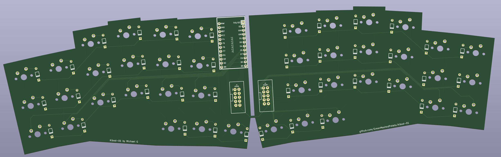

# kibod-01

 it's a keyboard inspired by [Slepet](https://github.com/ibnuda/Slepet) that has more stagger in some columns and only 3 thumb cluster keys instead of 5.

havent printed and test the keeb, try at your own risk

 

 ## License
 CERN Open Hardware Licence Version 2 - Strongly Reciprocal
