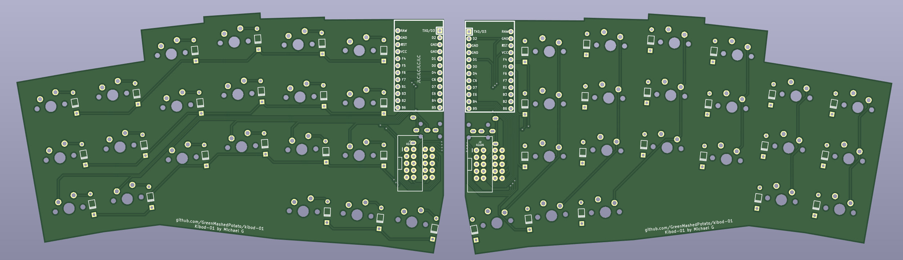
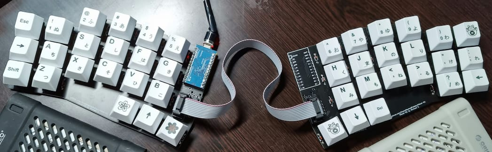
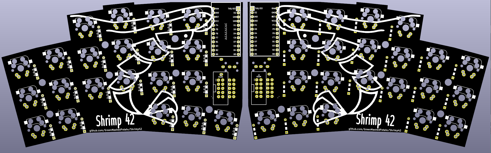
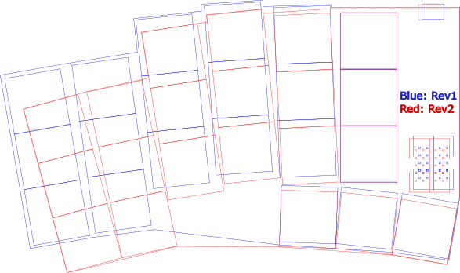

# kibod-01

it's a keyboard inspired by [Slepet](https://github.com/ibnuda/Slepet) that has more stagger in some columns and only 3 thumb cluster keys instead of 5.

Default Keyboard uses 1 pro micro with amphenol 10 cable:

 
Mirrored Keyboard, supports using 2 pro micros with trrs, or 1 pro micro with amphenol 10 cable:

Mirrored Keyboard Rev2, contains improvement from rev1 after using it for a while, supports using 1 pro micro with amphenol 10 cable:

improvements from rev1: 
- adds support for hotswap sockets, 
- changed angles from 2 to 3 degrees while reducing distance between columns. 
- dropped trrs support(might re-add if a lot of people requests this, i personally don't use trrs)

## Materials
 todo

## Disclaimer
I haven't printed some of it. No guarantees that they work. (tested the mirrored version(using amphenol cable not trrs), found and fixed some issues)
If things go wrong, I won't take any responisibilities, Try at your own risk.

## License
GPL-3.0 License
