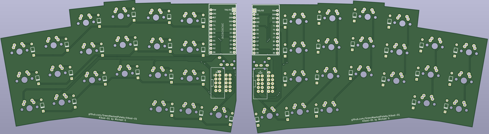

# Shrimp42(previously Kibod-01)

it's a keyboard inspired by [Slepet](https://github.com/ibnuda/Slepet) that has more stagger in some columns and only 3 thumb cluster keys instead of 5.

## Rev 1
Non Mirrored Keyboard uses 1 pro micro with amphenol 10 cable:

 
Mirrored Keyboard, supports using 2 pro micros with trrs, or 1 pro micro with amphenol 10 cable:

## Rev 2
Mirrored Keyboard Rev2(renamed to Shrimp42), contains improvement from rev1 after using it for a while:

improvements from rev1: 
- adds support for hotswap sockets
- adds support for smd diodes
- changed angles from 2 to 3 degrees while reducing distance between columns. 
- add board name: Shrimp 42

V1 vs V2

## Materials
 todo
 
## Firmware
QMK and VIAL (provided via firmware but will need to sideload json and is untested) firmware for using the keyboard like in my setup abov (using the extended GPIO pin to connect both halves and only 1 pro micro). [here](https://github.com/GreenMashedPotato/vial-qmk/tree/Shrimp42/keyboards/shrimp42).
 
Haven't made the firmware for TRRS version (and havent tested the trrs connection) (i used the same trrs wiring as in [Squiggle](https://github.com/ibnuda/Squiggle) you should in theory be able to modify its firmware to fit this keyboard, no guarantees it will work).

## Disclaimer
I haven't printed some of it. No guarantees that they work.
If things go wrong, I won't take any responisibilities, Try at your own risk.

## License
GPL-3.0 License
