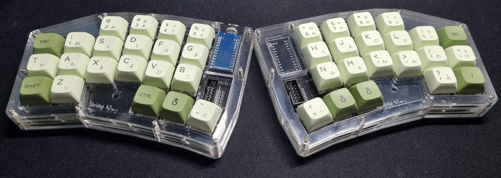

# Shrimp42(previously Kibod-01) Work In Progress

it's a keyboard inspired by [Slepet](https://github.com/ibnuda/Slepet) that has more stagger in some columns and only 3 thumb cluster keys instead of 5.

## Rev 1 (initial prototype)
Non Mirrored Keyboard uses 1 pro micro with 2x5 10pin IDC Connector:

 
Mirrored Keyboard, supports using 2 pro micros with trrs, or 1 pro micro with 2x5 10pin IDC Connector:

## Rev 2
Mirrored Keyboard Rev2(renamed to Shrimp42).

improvements from rev1: 
- adds support for hotswap sockets
- adds support for smd diodes
- changed angles from 2 to 3 degrees while reducing distance between columns. 
- add board name: Shrimp 42
- add Stacked Acrylic Case

V1 vs V2

## Materials

| Qnty | Ref | Value | Description |
| --- | --- | --- | --- |
| 1 (2 if using trrs) | U1 | Arduino Pro-Micro ATmega32U4 |
| 42 | D-0-0 - D-3-5 | 1N4148 | Diode: 1N4148 |
| 42 | K-0-0 - K-3-5 | MX or ALPS Switches | 1U |
| 42 (optional) | K-0-0 - K-3-5 | MX or ALPS Hotswap Sockets | this board supports the use of hotswap sockets and soldered connections |
| 2 | U2 | TRRS connectors OR 2x5 10pin IDC Connector |
| 1 | | TRRS Cable OR 2x5 10pin IDC Cable | used to connect both halves |
| 2 | | Shrimp42 pcb |
 
## Firmware
QMK and VIAL (provided via firmware but will need to sideload json and is untested) firmware for using the keyboard like in my setup above (using the extended GPIO pin to connect both halves and only 1 pro micro). [here](https://github.com/GreenMashedPotato/vial-qmk/tree/Shrimp42/keyboards/shrimp42).
 
QMK and VIAL for trrs connection (using 2 pro micros, slave board flipped, trrs connecting both sides) [here](https://github.com/GreenMashedPotato/vial-qmk/tree/Shrimp42/keyboards/shrimp42trrs)

## Contact me:
Twitter [@grnmashedpotato](https://twitter.com/GrnMashedPotato)
Reddit [u/greenmashedpotato](https://www.reddit.com/user/greenmashedpotato)

## Disclaimer
I haven't printed some of it. No guarantees that they work.
If things go wrong, I won't take any responisibilities, Try at your own risk.

## License
GPL-3.0 License
